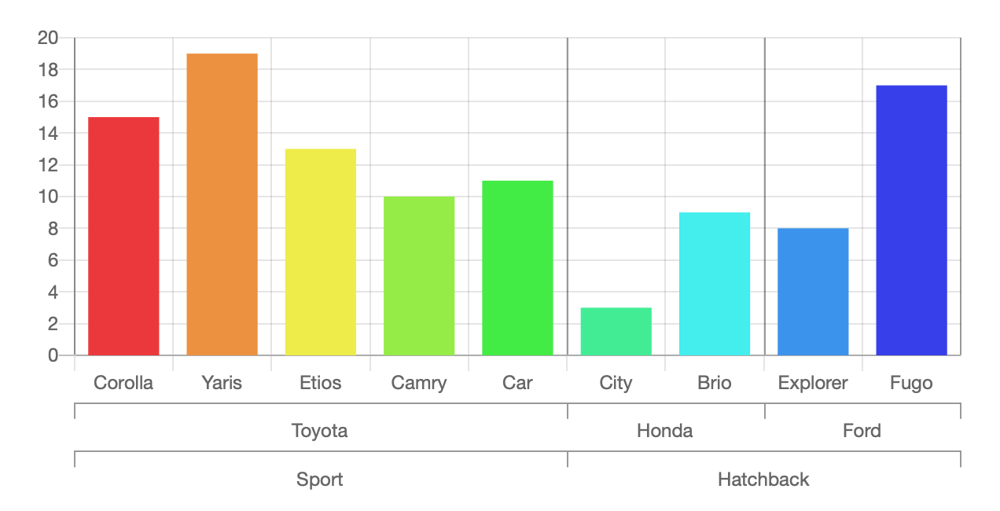

# Chart.js Extras

These are proof-of-concepts for extra chart types and features that are not officially supported by the [chart.js](https://www.chartjs.org) library.

## Charts

### Floating bar chart
https://codepen.io/elizzk/pen/oNvdbgN

### Grouped bar chart

https://codepen.io/elizzk/pen/YzKMxgV

### Waterfall chart

https://codepen.io/elizzk/pen/BaBwGLr

## Extra features

### Context menu

https://codepen.io/elizzk/pen/xxZjQvJ

### Minimap

https://codepen.io/elizzk/pen/OJMZMEm

